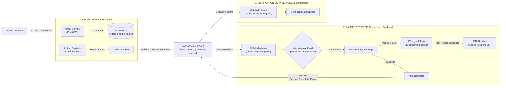

# 🚀 Event-Driven E-Commerce & Order-Payment Orchestration Engine
> A production-grade event-driven microservices system built with **Spring Boot 3**, **Apache Kafka (KRaft mode)**, **PostgreSQL**, and **Docker**.

---

## 🏗️ System Microservices Architecture



---

## 🛠️ Key Architectural Patterns Implemented

1. **Transactional Outbox Pattern (Phase 9):** Atomic local DB transaction saving `Order` and `OutboxEvent` to prevent Dual-Write inconsistencies.
2. **Key-Based Partitioning (Phase 2 & 7):** Hashing events by `customerId` to guarantee sequential entity processing.
3. **Application-Level Idempotent Consumer (Phase 6):** Duplicate detection via `processed_events` table in PostgreSQL.
4. **Resilient Retry & Backoff (Phase 5 & 6):** `@RetryableTopic` with Exponential Backoff ($1s \to 2s \to 4s$).
5. **Dead Letter Topic (DLT) & Reprocessing API (Phase 5, 6 & 9):** `@DltHandler` metadata preservation + REST Controller to inspect/re-process failed DLT events.
6. **Pub/Sub Broadcasting (Phase 1 & 4):** Multiple independent consumer groups (`payment-service-group` and `notification-service-group`).

---

## ⚡ Infrastructure Quickstart (`docker-compose.yml`)

```bash
# Spin up Kafka KRaft, PostgreSQL, and Kafdrop Web UI
docker-compose up -d
```
* **Kafdrop UI:** [http://localhost:9000](http://localhost:9000)
* **Kafka Broker:** `localhost:9092`
* **PostgreSQL:** `localhost:5432`
